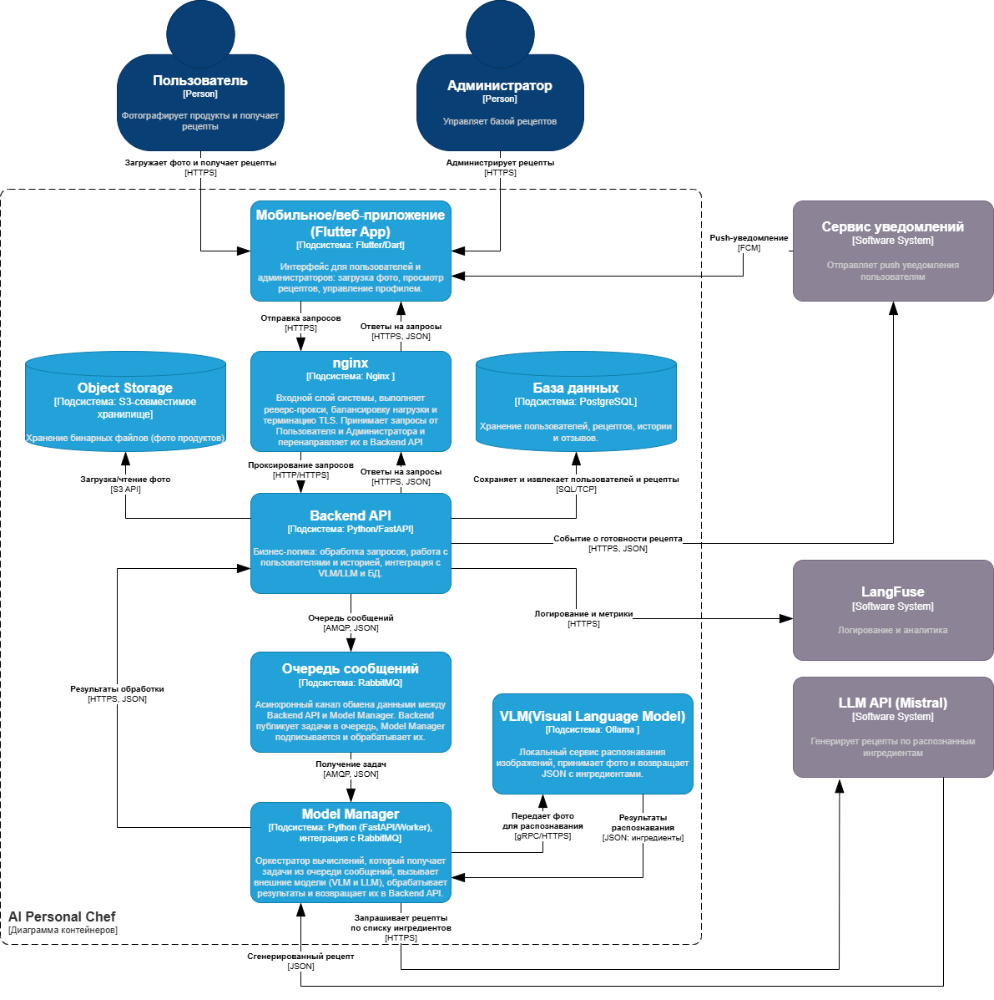

# Актуальная архитектура (C4)

## Context

## Containers

## Model Manager

## ADR (Architectural Decision Records)

### ADR‑1: Backend API на FastAPI
**Решение:** выбран FastAPI для реализации Backend API.  
**Причины:** простота разработки, поддержка асинхронности, встроенная документация OpenAPI/Swagger.  
**Альтернативы:** Flask (менее удобен для async), Django (избыточен для прототипа).  

---

### ADR‑2: RabbitMQ для асинхронного взаимодействия
**Решение:** RabbitMQ используется как очередь сообщений.  
**Причины:** устойчивость, поддержка AMQP, возможность горизонтального масштабирования.  
**Альтернативы:** Kafka (избыточен для прототипа), Redis Streams (менее надёжен для сложных сценариев).  

---

### ADR‑3: Model Manager как отдельный контейнер
**Решение:** вынесение Model Manager из Backend API.  
**Причины:** разделение ответственности, независимое масштабирование, упрощение интеграции с VLM/LLM.  
**Альтернативы:** встроить в Backend API (привело бы к монолиту и усложнило масштабирование).  

---

### ADR‑4: Ollama как VLM
**Решение:** Ollama выбран для распознавания изображений.  
**Причины:** локальная обработка, гибкость интеграции через HTTP/gRPC.  
**Альтернативы:** внешние API (дороже и менее контролируемо).  

---

### ADR‑5: Mistral API как LLM
**Решение:** Mistral API используется для генерации рецептов.  
**Причины:** готовый внешний сервис, поддержка текстовой генерации, простая интеграция.  
**Альтернативы:** OpenAI GPT (дороже), локальные LLM (требуют больше ресурсов).  

---

### ADR‑6: PostgreSQL как основная БД
**Решение:** PostgreSQL выбран для хранения пользователей, истории и рецептов.  
**Причины:** надёжность, транзакционность, поддержка ORM.  
**Альтернативы:** MySQL (уступает по расширенным возможностям), NoSQL (не подходит для транзакционных данных).  

---

### ADR‑7: Notification Service через FCM/APNS
**Решение:** для уведомлений используется внешний сервис (Firebase Cloud Messaging / Apple Push Notification Service).  
**Причины:** готовая инфраструктура, кроссплатформенность, минимизация затрат на разработку.  
**Альтернативы:** собственный сервис уведомлений (дорого и сложно поддерживать).  
