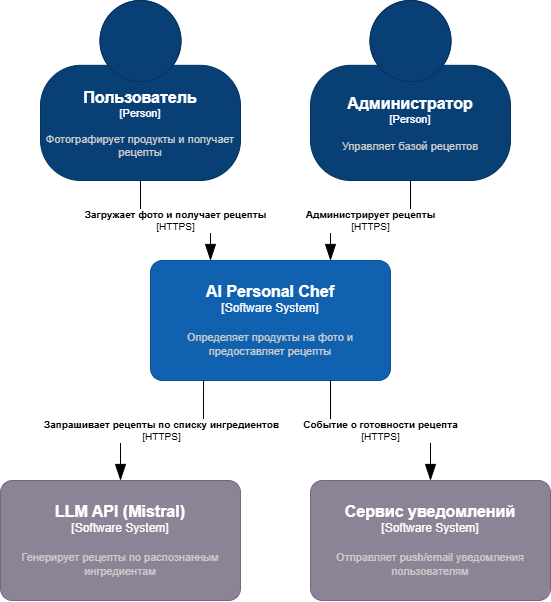

# C4 Architecture

## Context

## Containers

## Model Manager

## Model Manager Components

| Компонент          | Назначение                                   | Входные данные           | Выходные данные         |
|--------------------|----------------------------------------------|--------------------------|-------------------------|
| **Task Handler**   | Получает задачи из RabbitMQ и инициирует обработку | Сообщения (AMQP, JSON) | Задачи для коннекторов  |
| **VLM Connector**  | Отправляет фото в Ollama                     | Фото (HTTP/gRPC)         | Список ингредиентов     |
| **LLM Connector**  | Отправляет ингредиенты в Mistral API         | Ингредиенты (JSON)       | Сгенерированный рецепт  |
| **Aggregator**     | Собирает результаты от VLM и LLM             | Частичные результаты     | Итоговый ответ (JSON)   |

