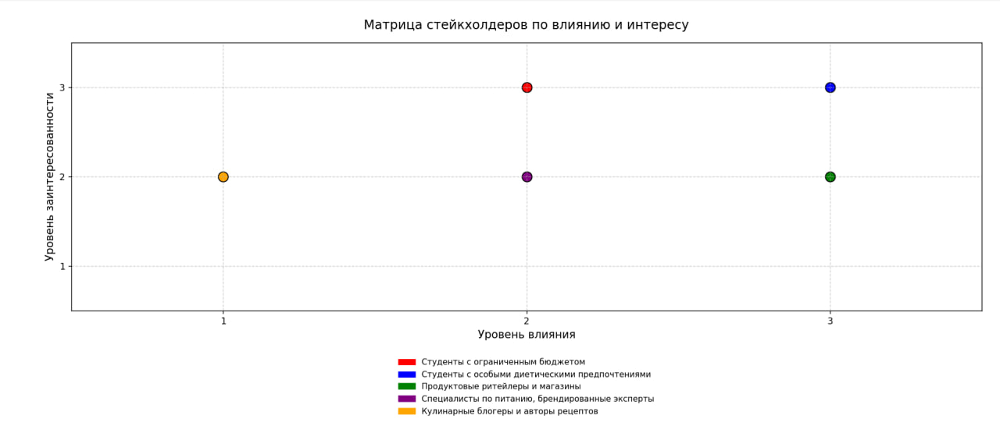

# D3 — Stakeholder Map

## Primary Stakeholders (основные заинтересованные стороны)
1. **Студенты с ограниченным бюджетом**  
   - **Influence Level:** Средний — напрямую влияют на развитие функционала, связанного с экономией и использованием остатков.  
   - **Interest Level:** Высокий — продукт решает их ключевые боли (экономия, разнообразие питания).  
   - **Communication Strategy:**  
     - Регулярные опросы внутри приложения о качестве рецептов и удобстве использования.  
     - Push-уведомления с подборками рецептов и акций.  

2. **Студенты с особыми диетическими требованиями**  
   - **Influence Level:** Средний — формируют требования к фильтрации рецептов, замене ингредиентов и подсчёту БЖУ.  
   - **Interest Level:** Высокий — продукт помогает безопасно питаться и экономить время на проверке состава.  
   - **Communication Strategy:**  
     - Персонализированные email- или push-рассылки с новыми рецептами под их диету.  
     - Встроенная обратная связь о корректности фильтрации и замены ингредиентов.  
     - Партнёрство с блогерами и сообществами по ЗОЖ/диетам.

---

## Secondary Stakeholders (вторичные заинтересованные стороны)
1. **Продуктовые ритейлеры и магазины**  
   - **Influence Level:** Высокий — могут интегрировать акции и скидки в приложение.  
   - **Interest Level:** Средний — заинтересованы в привлечении покупателей.  
   - **Communication Strategy:**  
     - B2B-переговоры о партнёрстве.  
     - Интеграция API с каталогами и акциями.

2. **Производители специализированных продуктов (безглютеновые, веганские и т.п.)**  
   - **Influence Level:** Средний — могут влиять на ассортимент и предложения.  
   - **Interest Level:** Средний — заинтересованы в продвижении своей продукции.  
   - **Communication Strategy:**  
     - Совместные промо-акции и рецепты с использованием их продуктов.  
     - Размещение брендированных подборок.

3. **Кулинарные блогеры и авторы рецептов**  
   - **Influence Level:** Низкий — не влияют на стратегию, но могут расширить базу рецептов и аудиторию.  
   - **Interest Level:** Средний — заинтересованы в продвижении своего контента.  
   - **Communication Strategy:**  
     - Коллаборации и взаимный обмен контентом.  
     - Упоминания авторов в приложении.

---

## Итоговая матрица влияния/заинтересованности

| Stakeholder                                      | Influence Level | Interest Level | Communication Strategy |
|--------------------------------------------------|-----------------|----------------|------------------------|
| Студенты с ограниченным бюджетом                 | 2         | 3        | Опросы, push, соцсети  |
| Студенты с особыми диетическими требованиями     | 3         | 3        | Персонализированные рассылки, обратная связь, партнёрства |
| Продуктовые ритейлеры и магазины                  | 3         | 2        | B2B-переговоры, интеграция API |
| Производители специализированных продуктов       | 2         | 2        | Совместные акции, брендированные подборки |
| Кулинарные блогеры и авторы рецептов             | 1          | 2        | Коллаборации, упоминания |

