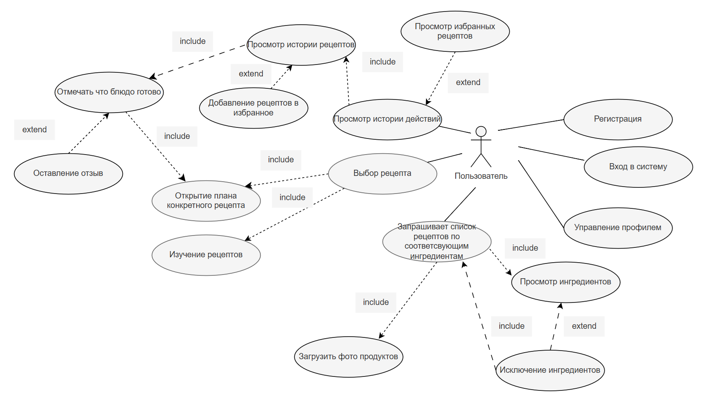

# Use-cases Narrative

## UC1 — Регистрация

| Поле              | Описание |
|-------------------|----------|
| **Название**      | Регистрация |
| **Акторы**        | Пользователь |
| **Предусловия**   | Пользователь ещё не зарегистрирован в системе |
| **Основной сценарий** | 1. Пользователь предоставляет данные для создания учётной записи. 2. Система проверяет корректность введённых данных. 3. Система создаёт новый аккаунт. 4. Пользователь получает доступ к системе. |
| **Постусловия**   | Создан новый аккаунт; пользователь авторизован |
| **Альтернативные сценарии** | Введены некорректные данные → система сообщает об ошибке и предлагает повторить ввод |

---

## UC2 — Вход в систему

| Поле              | Описание |
|-------------------|----------|
| **Название**      | Вход в систему |
| **Акторы**        | Пользователь |
| **Предусловия**   | Пользователь зарегистрирован |
| **Основной сценарий** | 1. Пользователь вводит свои учётные данные. 2. Система проверяет корректность данных. 3. Система предоставляет пользователю доступ к функционалу. |
| **Постусловия**   | Пользователь авторизован |
| **Альтернативные сценарии** | Введены неверные данные → система сообщает об ошибке и предлагает ввести пароль повторно или создать новый аккаунт |

---

## UC3 — Просмотр истории действий

| Поле              | Описание |
|-------------------|----------|
| **Название**      | Просмотр истории действий |
| **Акторы**        | Пользователь |
| **Предусловия**   | Пользователь авторизован; в системе есть сохранённые данные |
| **Основной сценарий** | 1. Пользователь запрашивает просмотр истории рецептов. 2. Система предоставляет список. |
| **Постусловия**   | Пользователь ознакомился с историей |
| **Альтернативные сценарии** | История пуста → система сообщает, что данных нет |

---

## UC4 — Управление профилем

| Поле              | Описание |
|-------------------|----------|
| **Название**      | Управление профилем |
| **Акторы**        | Пользователь |
| **Предусловия**   | Пользователь авторизован |
| **Основной сценарий** | 1. Пользователь открывает раздел профиля. 2. Пользователь изменяет данные (имя, предпочтения, ограничения). 3. Система сохраняет изменения. 4. Новые настройки учитываются при подборе рецептов и меню. |
| **Постусловия**   | Данные профиля обновлены |
| **Альтернативные сценарии** | Введены некорректные данные → система сообщает об ошибке и предлагает её исправить |

## UC5 — Запрос списка рецептов по соответствующим ингредиентам

| Поле              | Описание |
|-------------------|----------|
| **Название**      | Запрос списка рецептов по соответствующим ингредиентам |
| **Акторы**        | Пользователь (основной), Система (AI Personal Chef) |
| **Предусловия**   | Пользователь авторизован в приложении; устройство имеет доступ к камере или галерее; интернет‑соединение активно |
| **Основной сценарий** | 1. Пользователь делает снимок или выбирает фото из галереи. 2. Система предоставляет список распознанных ингредиентов. |
| **Постусловия**   | Список распознанных ингредиентов сохранён в истории пользователя; пользователь видит результат на экране |
| **Альтернативные сценарии** | Пользователя просят загрузить новое фото, если ни один продукт не распознан или нужно обработать ингредиенты заново | 

---

## UC6 — Исключение ингредиентов

| Поле              | Описание |
|-------------------|----------|
| **Название**      | Исключение ингредиентов |
| **Акторы**        | Пользователь (основной), Система (AI Personal Chef) |
| **Предусловия**   | Пользователь авторизован; список распознанных продуктов уже сохранён в системе; |
| **Основной сценарий** | 1. Пользователь исключает ингредиенты, которые не хочет использовать. 2. Система генерирует список рецептов на основе оставшихся ингредиентов и предоставляет его пользователю. |
| **Постусловия**   | Список рецептов доступен пользователю |
| **Альтернативные сценарии** | Система сгенерирует рецепты заново на основе фидбека пользователя | 

---
## UC7 — Выбор рецепта

| Поле              | Описание |
|-------------------|----------|
| **Название**      | Выбор рецепта |
| **Акторы**        | Пользователь (основной), Система (AI Personal Chef) |
| **Предусловия**   | Пользователь авторизован; список рецептов доступен пользователю; |
| **Основной сценарий** | 1. Пользователь изучает список рецептов и выбирает конкретный один рецепт. 2. Система предоставляет в текстовом формате план приготовления блюда.|
| **Постусловия**   | План приготовления выбранного блюда доступен пользователю |
| **Альтернативные сценарии** | Пользователь передумал готовить этот рецепт, переходит обратно к списку рецептов и выбирает один из оставшихся рецептов или система генерирует новые рецепты |

## UC8 — Оставление отзыва

| Поле              | Описание |
|-------------------|----------|
| **Название**      | Оставление отзыва |
| **Акторы**        | Пользователь (основной), Система (AI Personal Chef) |
| **Предусловия**   | Пользователь авторизован; рецепт помечен как приготовленный |
| **Основной сценарий** | 1. Пользователь инициирует оставление отзыва о приготовленном рецепте. 2. Пользователь формулирует текстовый отзыв и/или выставляет оценку. 3. Система сохраняет отзыв и связывает его с соответствующим рецептом в истории пользователя. |
| **Постусловия**   | Отзыв и/или оценка сохранены; данные учитываются системой для улучшения рекомендаций |
| **Альтернативные сценарии** | Пользователь отказывается оставлять отзыв → система завершает сценарий без сохранения данных |

---

## UC9 — Добавление в избранное

| Поле              | Описание |
|-------------------|----------|
| **Название**      | Добавление в избранное |
| **Акторы**        | Пользователь (основной), Система (AI Personal Chef) |
| **Предусловия**   | Пользователь авторизован; рецепт доступен в истории или помечен как приготовленный |
| **Основной сценарий** | 1. Пользователь выбирает рецепт и инициирует добавление в избранное. 2. Система сохраняет рецепт в списке избранных и связывает его с историей пользователя. 3. Пользователь видит обновлённый список избранных рецептов. |
| **Постусловия**   | Рецепт добавлен в избранное; данные учитываются системой для улучшения персональных рекомендаций |
| **Альтернативные сценарии** | Пользователь отказывается добавлять рецепт в избранное → система завершает сценарий без сохранения данных |
| **Ошибки**        | E1. Ошибка при добавлении рецепта в избранное → система сообщает: «Не удалось добавить в избранное. Попробуйте позже» и сохраняет действие в черновиках для повторной отправки |
