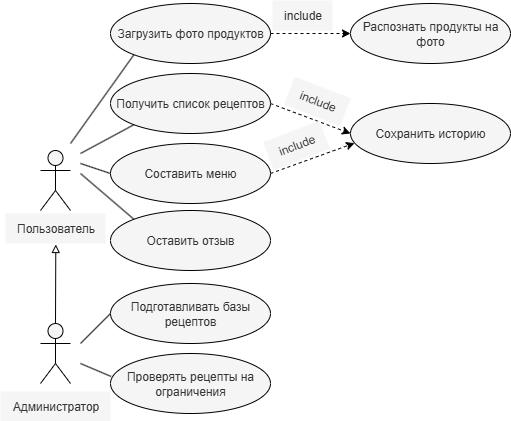

# Use-cases Narrative

## UC1 — Регистрация

**Акторы:** Пользователь

**Предусловия:** Пользователь ещё не зарегистрирован в системе

**Основной сценарий (Happy Path):**
1. Пользователь предоставляет данные для создания учётной записи (email, пароль, имя)
2. Система проверяет корректность и уникальность введённых данных
3. Система создаёт новый аккаунт
4. Система автоматически авторизует пользователя и перенаправляет его на главный экран

**Постусловия:** Создан новый аккаунт; пользователь авторизован

**Ценность:** Быстрый и безопасный процесс создания нового аккаунта

**Альтернативные сценарии:**
- A1. Введены некорректные данные (неверный формат email, слабый пароль) → система сообщает об ошибке и предлагает повторить ввод

**Ошибки:**
- **E1. Технический сбой при создании аккаунта** - Обработка: система отображает сообщение "Внутренняя ошибка сервера. Пожалуйста, попробуйте еще раз." и возвращает пользователя на форму регистрации
- **E2. Аккаунт с таким email уже существует** - Обработка: система проверяет уникальность email и отображает сообщение "Пользователь с таким email уже зарегистрирован", предлагая восстановить пароль или использовать другой email
- **Ценность ошибок:** Предотвращение дублирования аккаунтов и четкие инструкции для пользователя

---

## UC2 — Вход в систему

**Акторы:** Пользователь

**Предусловия:** Пользователь зарегистрирован

**Основной сценарий (Happy Path):**
1. Пользователь вводит свои учётные данные (email и пароль)
2. Система проверяет корректность данных
3. Система предоставляет пользователю доступ к функционалу, перенаправляя на главный экран

**Постусловия:** Пользователь авторизован

**Ценность:** Быстрый и безопасный доступ к персональному функционалу приложения

**Альтернативные сценарии:**
- A1. Введены неверные данные → система сообщает об ошибке "Неверный email или пароль" и предлагает ввести данные повторно или создать новый аккаунт

**Ошибки:**
- **E1. Сервис аутентификации недоступен** - Обработка: система отображает сообщение "Сервис временно недоступен. Проверьте подключение к интернету и попробуйте снова"
- **Ценность:** Пользователь понимает, что проблема временная и связана не с его данными, а с соединением или сервером

---

## UC3 — Просмотр истории действий

**Акторы:** Пользователь

**Предусловия:** Пользователь авторизован; в системе есть сохранённые данные

**Основной сценарий (Happy Path):**
1. Пользователь запрашивает просмотр истории рецептов
2. Система загружает и предоставляет упорядоченный список ранее просмотренных и приготовленных рецептов

**Постусловия:** Пользователь ознакомился с историей

**Ценность:** Пользователь может легко найти и повторить понравившиеся рецепты

**Альтернативные сценарии:**
- A1. История пуста → система сообщает, что данных нет, и предлагает перейти к поиску рецептов

**Ошибки:**
- **E1. Не удалось загрузить историю** - Обработка: система отображает сообщение "Не удалось загрузить историю. Пожалуйста, перезагрузите страницу" и кнопку "Повторить"
- **Ценность:** Пользователь получает понятную инструкцию по решению проблемы, а не просто видит пустой экран

---

## UC4 — Управление профилем

**Акторы:** Пользователь

**Предусловия:** Пользователь авторизован

**Основной сценарий (Happy Path):**
1. Пользователь открывает раздел профиля
2. Пользователь изменяет данные (имя, диетические предпочтения, аллергии)
3. Система валидирует изменения
4. Система сохраняет изменения и подтверждает это сообщением "Данные успешно обновлены"
5. Новые настройки учитываются при подборе рецептов и меню

**Постусловия:** Данные профиля обновлены

**Ценность:** Персонализация работы приложения и повышение релевантности рекомендаций

**Альтернативные сценарии:**
- A1. Введены некорректные данные (например, недопустимые символы в имени) → система сообщает об ошибке и предлагает её исправить, подсвечивая проблемное поле

**Ошибки:**
- **E1. Ошибка синхронизации с сервером** - Обработка: система отображает сообщение "Изменения не сохранены. Проверьте подключение к интернету", сохраняет данные локально и пытается отправить их повторно при восстановлении соединения
- **Ценность:** Пользовательские данные не теряются даже при временных сбоях сети

---

## UC5 — Запрос списка рецептов по соответствующим ингредиентам

**Акторы:** Пользователь (основной), Система (AI Personal Chef)

**Предусловия:** Пользователь авторизован в приложении; устройство имеет доступ к камере или галерее; интернет‑соединение активно

**Основной сценарий (Happy Path):**
1. Пользователь делает снимок или выбирает фото из галереи
2. Система обрабатывает изображение, распознаёт ингредиенты и отображает их список для подтверждения
3. Пользователь подтверждает список
4. Система генерирует и предоставляет список рецептов на основе распознанных ингредиентов

**Постусловия:** Список распознанных ингредиентов сохранён в истории пользователя; пользователь видит результат на экране

**Ценность:** Быстрый и удобный способ получить рецепты на основе имеющихся продуктов

**Альтернативные сценарии:**
- A1. Ни один продукт не распознан → система просит загрузить новое, более чёткое фото

**Ошибки:**
- **E1. Ошибка распознавания изображения (таймаут, сбой ML-модели)** - Обработка: система отображает сообщение "Не удалось обработать изображение. Пожалуйста, попробуйте еще раз или введите ингредиенты вручную"
- **E2. Нет сети для отправки изображения на сервер** - Обработка: система уведомляет пользователя "Отсутствует интернет-соединение. Для распознавания необходим доступ в сеть"
- **Ценность:** Пользователь понимает причину сбоя и имеет альтернативный путь (ручной ввод)

---

## UC6 — Исключение ингредиентов

**Акторы:** Пользователь (основной), Система (AI Personal Chef)

**Предусловия:** Пользователь авторизован; список распознанных продуктов уже сохранён в системе

**Основной сценарий (Happy Path):**
1. Пользователь исключает ингредиенты, которые не хочет использовать, снимая с них отметку
2. Система генерирует новый список рецептов на основе оставшихся ингредиентов и предоставляет его пользователю

**Постусловия:** Список рецептов доступен пользователю

**Ценность:** Точная настройка результатов поиска под нужды пользователя

**Альтернативные сценарии:**
- A1. Пользователь не исключил ни одного ингредиента → система использует исходный полный список

**Ошибки:**
- **E1. Не удалось сгенерировать рецепты после исключения** - Обработка: система отображает сообщение "По оставшимся ингредиентам не найдено подходящих рецептов. Попробуйте исключить меньше продуктов"
- **Ценность:** Чёткая обратная связь, направляющая пользователя к решению проблемы

---

## UC7 — Выбор рецепта

**Акторы:** Пользователь (основной), Система (AI Personal Chef)

**Предусловия:** Пользователь авторизован; список рецептов доступен пользователю

**Основной сценарий (Happy Path):**
1. Пользователь изучает список рецептов и выбирает конкретный один рецепт
2. Система загружает и предоставляет детальную страницу рецепта с пошаговым планом приготовления блюда в текстовом формате

**Постусловия:** План приготовления выбранного блюда доступен пользователю

**Ценность:** Пользователь получает всю необходимую информацию для приготовления блюда

**Альтернативные сценарии:**
- A1. Пользователь передумал → возвращается к списку рецептов

**Ошибки:**
- **E1. Не удалось загрузить детали рецепта** - Обработка: система отображает сообщение "Рецепт временно недоступен" и кнопку "Вернуться к списку"
- **Ценность:** Пользователь не "зависает" на пустом экране и может продолжить работу

---

## UC8 — Оставление отзыва

**Акторы:** Пользователь (основной), Система (AI Personal Chef)

**Предусловия:** Пользователь авторизован; рецепт помечен как приготовленный

**Основной сценарий (Happy Path):**
1. Пользователь инициирует оставление отзыва о приготовленном рецепте
2. Пользователь формулирует текстовый отзыв и/или выставляет оценку
3. Система сохраняет отзыв и связывает его с соответствующим рецептом в истории пользователя
4. Система подтверждает сохранение отзыва

**Постусловия:** Отзыв и/или оценка сохранены; данные учитываются системой для улучшения рекомендаций

**Ценность:** Улучшение персональных рекомендаций и помощь другим пользователям

**Альтернативные сценарии:**
- A1. Пользователь отказывается оставлять отзыв → система завершает сценарий без сохранения данных

**Ошибки:**
- **E1. Ошибка при отправке отзыва** - Обработка: система сообщает "Не удалось отправить отзыв. Попробуйте позже" и сохраняет отзыв в черновиках для последующей отправки
- **Ценность:** Пользовательский ввод не теряется, что повышает вероятность того, что отзыв всё же будет отправлен
